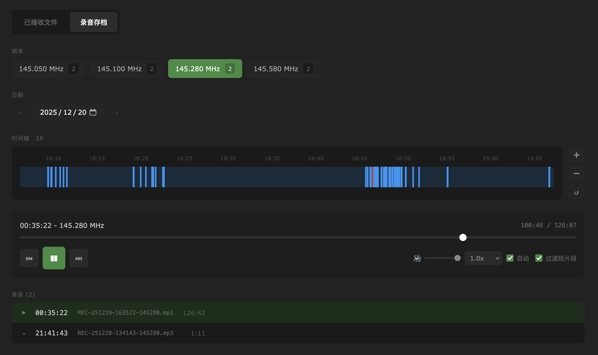

# Radio Archive

OpenWebRX+ 录音文件的时间轴播放器插件。将 AudioRecorder 录制的音频文件以可视化时间轴形式展示，方便按频率和日期浏览、回放历史录音。



## 功能介绍

- **时间轴视图**: 24 小时时间轴展示录音分布，支持缩放平移
- **静噪检测**: 自动分析并高亮显示有效音频段
- **智能播放**: 自动跳过静音部分，支持连续播放
- **多语言**: 支持中文、英文、日文
- **快捷键**: `Space` 播放/暂停，`←/→` 快退/快进 5 秒

## 安装指引

### 1. 配置 AudioRecorder

参考 [官方文档](https://fms.komkon.org/OWRX/) 启用 Background Decoding 和 Audio Recorder，并在 `bands.json` 中添加需要录制的频率：

```json
"frequencies": {
    "audio": { "frequency": 145700000, "underlying": "nfm" }
}
```

### 2. 注入脚本

在 **Settings → General Settings → Photo description** 中添加脚本。

**方式一：CDN 引入（推荐）**

无需下载，直接使用：

```html
<script src="https://unpkg.com/vue@3/dist/vue.global.prod.js"></script>
<script src="https://bg5drb.oss-cn-hangzhou.aliyuncs.com/radio-archive.js"></script>
```

**方式二：本地部署**

将 `radio-archive.js` 放入插件目录后引入：

```bash
cp dist/radio-archive.js /path/to/openwebrx/plugins/receiver/radio-archive/
```

```html
<script src="https://unpkg.com/vue@3/dist/vue.global.prod.js"></script>
<script src="static/plugins/receiver/radio-archive/radio-archive.js"></script>
```

> Docker 环境需先将 plugins 目录映射出来

### 3. 访问

打开 `/files` 页面即可使用。

### 4. 服务端补丁（可选）

如需完整的时间轴精准定位功能（语音时间映射、音频时长读取等），建议配合 [openwebrx-bg5drb-patch](https://github.com/boybook/openwebrx-bg5drb-patch) 使用。该补丁为录音生成时间戳映射文件，支持 Docker 一键部署。

## 本地开发

### 环境要求

- Node.js >= 18
- npm >= 9

### 快速开始

```bash
# 安装依赖
npm install

# 开发模式 (热更新，访问 http://localhost:5173)
npm run dev

# 监视模式 (自动构建到 dist/)
npm run watch

# 生产构建
npm run build
```

### 实时开发技巧

创建软链接配合 `npm run watch`，实现修改后自动更新：

```bash
ln -s /path/to/radio-archive/dist/radio-archive.js \
      /path/to/openwebrx/plugins/receiver/radio-archive/radio-archive.js
```

## License

MIT